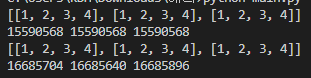

# 11 Best Freelance Python Developers for Hire

### 1. 함수 데코레이터를 사용하는 이유는?

데코레이터는 하나의 데코레이터 정의를 여러 함수나 클래스에서 적용할 수 있습니다.  
또한 데코레이터에는 일급 함수와 클로저에 대한 내용도 포함되기에 숙지할 필요가 있습니다.  
데코레이터의 예시로는 로깅, 특정 형식 적용, 타이머 등과 같은 것들이 있으며 코드를 재사용하기 좋다는 장점이 있습니다.  
제가 많이 사용했던 내용에는 아래와 같은 타이머 코드가 있었습니다.

```python
import time


def timer(func):
    def inner_func(*args, **kargs):
        start_time = time.time()

        result = func(*args, **kargs)

        end_time = time.time()

        print(f"{end_time - start_time} ms")
        return result

    return inner_func


@timer
def testFunc(n):
    s = 0

    for i in range(1000000):
        if i % 10000 == 0:
            s += i

    return (s, n)


print(f"result: {testFunc(10000)}")
# result: 
# 0.04999995231628418 ms
# (49500000, 10000)
```

### 2. 람다 표현식과 리스트 컴프리헨션 그리고 제너레이터 표현식이란 무엇인가?

먼저 람다 표현식은 익명 함수를 의미합니다.  
람다 표현식으로 인해서 코드가 간결해지기는 합니다.  
하지만 클린코드적 관점에서 보자면 람다 표현식은명확한 명칭으로 인해 구분되지 않기에 정말 간단한 코드가 아니라면 사용하지 않는 것이 좋을 듯 합니다.  
  
다음으로 리스트 컴프리헨션의 경우 성능상 일반 포문이나 내장된 map, filter 함수 등에 비해 약간의 성능적 이득을 볼 수 있습니다.  
하지만 이러한 성능보다는 한 줄로 표현되는 명확하고 간결한 코드를 표현하기에 좋으며 이터러블한 객체에 대해서 매우 명확하고 손쉽게 리스트를 만들어낼 있는 방법입니다.  
  
제너레이터 표현식은 리스트와 매우 비슷합니다.  
하지만 다른 점은 매우 큰 데이터에 적합한데 큰 데이터에 적합한 이유로는 데이터를 메모리에 한 번에 적재하지 않고 필요할 때마다 필요한 만큼씩 메모리를 사용하고 이로 인해서 메모리가 최적화됩니다.

### 3. 배열을 생성하기 위한 두 방식의 차이는 무엇인가?

```python
x = [[1,2,3,4]] * 3
print(x)
# result: [[1, 2, 3, 4], [1, 2, 3, 4], [1, 2, 3, 4]]

y = [[1,2,3,4] for _ in range(3)]
print(y)
# result: [[1, 2, 3, 4], [1, 2, 3, 4], [1, 2, 3, 4]]
```

이 두 방식의  차이는 간단합니다.  
먼저 첫 번째 방식은 얉은 복사 방식으로 동작하고 두 번째 방식은 독립적인 각각의 배열로 깊은 복사가 됩니다.

  
아래는 제가 테스트한 예시입니다.  
각각의 원소들의 id값을 출력해보면 첫 번째 방식은 모든 원소가 동일한 id값을 가지고 있으며 두 번째 방식은 각기 다른 id 값을 가지고 있는 모습을 볼 수 있습니다.



### 4. 아래 코드의 출력 결과는 어떻게 되는가?

```python
def append(list=[]):
    list.append(len(list))
    return list


append(["a", "b"])

append()

append()

```

위 코드의 결과는 첫 번째 결과는 \['a', 'b', 2\]가 되고 그 다음 append함수 호출에서는 \[0\] 그 다음 호출에서는 \[0, 1\]이라는 결과를 반환합니다.  
이는 python의 함수의 인자의 기본값이 표현식이라면 함수가 호출될때 표현식이 한 번만 평가가 되는데 이로인해 인자가 지정되지 않았을때는 이전에 평가된 표현식을 그대로 사용하기 때문에 인자가 지정되지 않은 경우에는 모두 같은 객체를 사용합니다.  
  
위의 문제를 겪지 않기 위해서는 아래와 같은 코드처럼 사용해야합니다.

```python
def append(list=None):
    if list == None:
        list = []

    list.append(len(list))
    return list
    ㅇ
```

이처럼 작성해야 예상치 않은 문제를 예방할 수 있습니다.  
이는 list나 dictionary와 같은 자료형의 문제가 아니기 때문에 주의해야합니다.  
함수의 인자의 기본값을 객체로 두지 않고 초기화를 매번 수행해주도록 해야합니다.

### 5. 두 변수의 값을 서로 바꿔주는 방법은?

```python
x = 'Y'
y = 'X'

```

파이썬에는 언 패킹이라는 있어서 간단히 구현할 수 있습니다.  
C언어에서는 temp와 같은 임시 변수를 두고 스왑을 해주는 과정을 거쳐야 했으나 파이썬에서는 아래와 같이 간단히 구현할 수 있습니다.

```python
x, y = y, x
```

### 6. 아래의 값은 어떤 결과를 출력하는가? 그리고 수정하려면?

```python
flist = []

for i in range(3):
    flist.append(lambda: i)

print([f() for f in flist])
# result: [2, 2, 2]이
```

자바스크립트를 공부할때 한 때 큰 벽이 되었던 클로저의 개념입니다.  
이는 익명 함수가 변수 i를 계속 가지고 있다가 추후 실행이 되면서 변수의 유효범위가 전역으로 잡힌 문제입니다.  
이때 print로 출력해주기 이전에 변수 i의 값을 바꾸어주면 그 값으로 리스트가 초기화 되는 것을 볼 수 있습니다.  
이를 해결해주기 위해서는 익명 함수가 지역 변수를 가지도록 해주어야 하는데 이는 매우 간단합니다.  
아래와 같이 바꾸어주면 됩니다.

```python
flist = []

for i in range(3):
    flist.append(lambda x=i: x)

print([f() for f in flist])
# result: [0, 1, 2]

```

### 7. Python 2와 3의 주요 차이점은 무엇인가?

개인적으로 생각하는 python2와 python3의 주요 차이점은 인코딩의 문제라고 생각합니다.  
또한 python2는 이제 거의 쓰이지 않기에 python2에서는 xrange와 range가 별도로 있었다는 사실도 이제 공부를 하고 계신 분들은 알지 못할 이야기가 되었습니다.  
그리고 python3에서는 generator를 좀더 적극적으로 사용하게 되어 map, filter와 같은 함수에서는 연산을 수행하고난 값을 바로 리턴하는 것이 아닌 제너레이터를 반환하도록 바뀌었습니다.  
기억이나는 python2에서의 차이점은 이정도입니다.  
  
느낀점은 python2에 비해서 python3은 성능적인 면에서 좀더 고민을 많이한 것 같고 그 고민을 제너레이터로 해결하려 노력한 것 같다는 생각을 했었습니다.

### 8. 파이썬은 인터프리터언어인가 컴파일 언어인가?

파이썬 자체는 인터프리터 언어이지만 Cython이나 Jython 그리고 PyPy 같은 방식으로 컴파일될 수 있습니다.

### 9. Cython은 어떤것이며 어떤때 사용하는가?

Cython은 Python코드를 C언어로 Python을 빌드함으로써 수행 속도를 올린 방법입니다.  
Python은 다른 언어에 비해 상대적으로 느린 언어이기 때문에 이와 같은 방법으로 수행 속도를 올리려는 노력을 기하고 있습니다.  
그리고 PyPy라는 Python으로 Python을 만드는 프로젝트가 있는데 이 프로젝트는 오히려 Cython보다 좋은 성능을 보여주는 등 많은 방식들이 있습니다.  
PyPy가 Python보다 좋은 성능을 보여주는데 가장 큰 역할을 한것에는 Just-In-Time 컴파일이며 이 기법은 같은 코드를 매번 실행하는 대신 자주 쓰이는 코드를 캐싱한뒤 그 코드를 가져다 사용하여 빠른 속도를 보여줍니다.

### 10. Python에서 단위 테스트에 대한 당신의 접근법은?

사실 파이썬에서 단위 테스트와 관련해서는 저는 많이 부족합니다.  
파이썬에서 가장 유면한 unittest를 사용해본적이 없고 파이썬의 if \_\_name\_\_ == '\_\_main\_\_' 구문과 assert를 이용하여 직접 시나리오를 짜고 사용법과 같이 표현을 한적은 있으나 unittest와 같은 정교한 단위 테스트는 수행해본적이 없습니다.  
자동화된 테스트는 곧 경험해보고 지속적으로 사용해야겠다고 생각하고 있습니다.

### 11. 파이썬의 단점은 무엇이라고 생각하는가?

파이썬의 가장 큰 단점은 속도라고 생각합니다.  
GIL이 악명이 높은 것은 알고 있으나 오히려 잡기 어려운 메모리 취약점이 줄어드는 등 장점이 더 많다고 생각하고 비동기나 병렬처리같은 방식으로 충분히 해결할 수 있는 부분들이라고 생각하고 있습니다.  
속도를 제외한다면 약타입 언어이기에 타입에 대한 강제가 부족하단 점이 단점일 수 있으나 최근엔 Type Hint로 인해 이것 역시 많이 나아진 상황이라고 생각합니다.  
오히려 너무 타입이 강제되어도 의사 코드에 가깝다는 평을 듣는 파이썬의 장점을 헤치는 것이 될 수 있다고 생각합니다.  
단 협업을 위해서는 타입이 강제되는 것은 필요하다고 생각하기에 파이썬의 docstring과 Type Hint의 조합이라면 그러한 단점은 이미 해결이 되어가고 있지 않나라는 생각이 듭니다.


